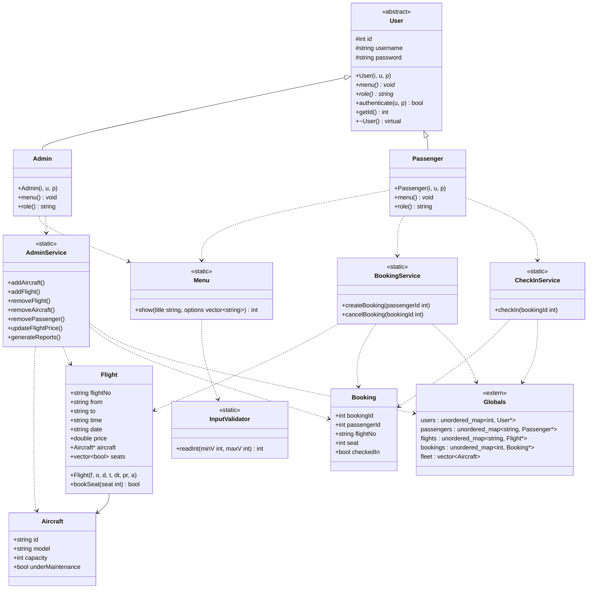

<div align="center">

#  Airline Reservation & Management System

**A console-based airline platform built with C++ and Object-Oriented Design**


### 🎬 [Watch the Project Demo Video](https://drive.google.com/file/d/1SS3-YXorgILthpP8aAQpI6NQD8x2uUNC/view?usp=sharing)

</div>

---

##  Table of Contents

1. [Overview](#-overview)
2. [Features](#-features)
3. [Application Flow](#-application-flow)
4. [System Flow Diagram](#-system-flow-diagram)
5. [Project Structure](#-project-structure)
6. [Architecture](#-architecture)
7. [UML Class Diagram](#-uml-class-diagram)
8. [Technical Concepts](#-technical-concepts)
9. [Complexity](#-complexity)
10. [Getting Started](#-getting-started)
11. [Default Credentials](#-default-credentials)
12. [Known Limitations](#-known-limitations)
13. [Future Improvements](#-future-improvements)
14. [Purpose](#-purpose)

---

##  Overview

This project simulates a real-world airline system with three main parts:

| Module | Description |
|--------|-------------|
| **Admin Control Panel** | Manage the fleet, flights, pricing, passenger accounts, and reports |
| **Passenger Portal** | Register, log in, book a flight with a chosen seat, check in, and cancel |
| **Flight & Aircraft Management** | Every flight is assigned an aircraft; the seat count comes from the aircraft capacity |

All data is kept in memory for the duration of the session.

---

##  Features

###  Admin

- Add Aircraft (ID, model, capacity)
- Add Flight (number, route, time, date, price, assigned aircraft)
- Remove Flight (also deletes all bookings of that flight)
- Remove Aircraft (blocked while the aircraft is assigned to a flight)
- Remove Passenger Account (also deletes the passenger's bookings)
- Update Flight Price
- Generate Reports (booked seats, total seats, price, and revenue per flight)

###  Passenger

- Register (unique username enforced) / Login
- View available flights with price, free-seat count, and free seat numbers
- Book a flight and choose a specific seat
- Seat double-booking prevention
- Check in using a booking ID
- Cancel a booking (the seat is released)

###  General

- Validated menu input (invalid or out-of-range choices are rejected and re-requested)
- Memory cleanup of admin, passengers, flights, and bookings on exit

---

##  Application Flow

Below is the real console flow of the application.

### 1. Main Screen & Admin Login

```text
================== Welcome to Airline Reservation and Management System ==================
Are you Admin or Passenger? (A/P) or type ' exit ' : [ to quit close Airline System ] : A
Username: admin
Password: 1234
Welcome, Admin!
```

### 2. Admin Menu

```text
================= Admin Menu=================
0. Logout from Admin list to another list 
1.Add Aircraft
2.Add Flight
3.Remove Flight
4.Remove Aircraft
5.Remove Passenger Account
6.Update Flight Price
7.Generate Reports
8.Exit System
Choose:
```

### 3. Add Aircraft

```text
Choose:1
Aircraft ID: AC001
Model: Boeing737
Capacity: 180
Aircraft added successfully.
```

### 4. Add Flight

```text
Choose:2
Flight Number: MS101
From: Cairo
To: Dubai
Time: 14:30
Date: 2026-10-15
Price: 350
Select Aircraft (1 - 1): 1
Flight added successfully.
```

If no aircraft exists yet:

```text
No aircraft available. Add aircraft first.
```

### 5. Update Flight Price

```text
Choose:6
Enter Flight Number to update price: MS101
Enter new price: $390
Price updated successfully.
```

### 6. Generate Reports

```text
Choose:7

===== Flights Report =====
Flight: MS101 | From: Cairo | To: Dubai | Booked Seats: 2 | Total Seats: 180 | Price: $390 | Revenue: $780
```

### 7. Passenger Registration

```text
Are you Admin or Passenger? (A/P) or type ' exit ' : [ to quit close Airline System ] : P
Do you have an account? (yes/no): no
Enter Username: sara
Enter Password: 1234
Account created successfully!
```

An existing username is rejected:

```text
Enter Username: sara
Username already exists. Try another.
```

### 8. Passenger Login

```text
Do you have an account? (yes/no): yes
Username: sara
Password: 1234
Welcome, sara!
```

### 9. Passenger Menu

```text
================= Passenger Menu=================
0.Logout from Passenger list to another list 
1.Book Flight
2.Check-in
3.Cancel Booking
4.Exit System
Choose:
```

### 10. Book a Flight & Select a Seat

```text
Choose:1
Available Flights:
FlightNo: MS101 | Cairo -> Dubai | Date: 2026-10-15 | Time: 14:30 | Price: $390 | Available Seats: 180 | Seats: 1 2 3 4 5 6 7 8 9 10 11 12 ... 180
Enter Flight Number: MS101
Enter Seat Number ( 1 - 180): 12
Booking successful. ID: 1
```

Possible messages:

```text
No flights available.
Flight not found.
Seat already taken.
```

### 11. Check-in

```text
Choose:2
Enter Booking ID: 1
Check-in completed. Booking ID: 1
```

### 12. Cancel Booking

```text
Choose:3
Enter Booking ID: 1
Booking cancelled successfully.
```

### 13. Input Validation

```text
Choose:abc
Invalid input. Try again: 
```

### 14. Exit

```text
Exiting system...
```

---

##  System Flow Diagram

[](https://postimg.cc/k6yvw89B)

---

##  Project Structure

The project is header-based: each class lives in its own header and the entry point wires everything together.

```text
.
├── main.cpp              # Entry point, global containers, login/registration loop
├── Globals.h             # extern declarations of the global STL containers
├── User.h                # Abstract base class
├── Admin.h               # Admin menu (inherits User)
├── Passenger.h           # Passenger menu (inherits User)
├── Aircraft.h            # Aircraft model
├── Flight.h              # Flight model + seat booking
├── Booking.h             # Booking model
├── AdminService.h        # Admin operations
├── BookingService.h      # Create / cancel booking
├── CheckInService.h      # Check-in operation
├── Menu.h                # Reusable menu renderer
└── InputValidator.h      # Validated integer input
```

> Rename `main.cpp` to match your actual entry-point file.

---

##  Architecture

The project follows a **service-layer architecture**:

```text
┌──────────────────────────────────────────────────────────┐
│  Presentation Layer :  Menu  ·  InputValidator           │
├──────────────────────────────────────────────────────────┤
│  User Layer         :  User (abstract) → Admin, Passenger│
├──────────────────────────────────────────────────────────┤
│  Service Layer      :  AdminService · BookingService     │
│                        CheckInService                    │
├──────────────────────────────────────────────────────────┤
│  Domain Models      :  Aircraft · Flight · Booking       │
├──────────────────────────────────────────────────────────┤
│  Data Layer         :  Globals.h (in-memory STL)         │
└──────────────────────────────────────────────────────────┘
```

| Layer | Responsibility |
|-------|----------------|
| **Presentation** | `Menu::show` renders numbered menus; `InputValidator::readInt` validates choices |
| **User** | `Admin` and `Passenger` implement `menu()` and `role()` polymorphically |
| **Service** | Business rules for administration, booking/cancellation, and check-in |
| **Domain** | `Flight::bookSeat` handles seat state; `Aircraft` and `Booking` hold data |
| **Data** | Global `unordered_map` and `vector` containers shared by all services |

---

##  UML Class Diagram



### Relationships

| Type | Relationship |
|------|--------------|
| **Inheritance** | `Admin → User`, `Passenger → User` |
| **Association** | `Flight → Aircraft` (`aircraft*`), `Booking → Flight` (by `flightNo`) |
| **Dependency** | `Admin → AdminService`, `Passenger → BookingService / CheckInService`, `Admin / Passenger → Menu`, `Menu → InputValidator` |
| **Shared data** | Services and `main` use the global containers declared in `Globals.h` |

---

##  Technical Concepts

- **OOP**: inheritance, polymorphism (`menu()` / `role()` overridden per user type), abstraction (abstract `User`)
- **STL**: `unordered_map`, `vector`, structured bindings
- **Dynamic memory management**: `new` / `delete` for users, flights, and bookings; virtual destructor in `User`
- **Input validation**: range-checked integer input with stream recovery
- **Service-layer architecture**: business logic separated from the menu classes

---

##  Complexity

| Operation | Complexity |
|-----------|------------|
| Lookup of flight / passenger / booking (`unordered_map`) | O(1) average |
| Seat booking (`vector<bool>` index) | O(1) |
| Listing free seats of a flight | O(seats) |
| Removing a flight or passenger (scans bookings) | O(bookings) |

---

##  Getting Started

### Prerequisites

- A C++17 compiler (GCC or Clang). The code includes `<bits/stdc++.h>`, which MSVC does not provide.

### Build & Run

```bash
git clone <your-repository-url>
cd <repository-folder>

g++ -std=c++17 -Wall -Wextra main.cpp -o airline

./airline          # Linux / macOS
airline.exe        # Windows (MinGW)
```

---

##  Default Credentials

| Role | Username | Password |
|------|----------|----------|
| Admin | `admin` | `1234` |

>  Demo credentials for a learning project only. Passenger accounts are created at runtime.

---

##  Known Limitations

- **No persistence**: all data is lost when the program exits.
- **Single-word input**: text fields are read with `cin >>`, so aircraft models and city names must be one word (e.g. `Boeing737`, `NewYork`).
- **Plain-text passwords**, echoed on screen.
- **Session-based IDs**: passenger IDs restart at 1 on every run.
- **Admin credentials** are hard-coded.

---

##  Future Improvements

- [ ] File / database persistence (SQL)
- [ ] Multi-word input with `getline`
- [ ] Password hashing and hidden input
- [ ] Booking ownership check on cancel / check-in
- [ ] Payment system
- [ ] Ticket export (PDF)
- [ ] GUI (Qt / Web)

---

##  Purpose

- Practice real-world system design
- Improve OOP skills
- Prepare for technical interviews

---


